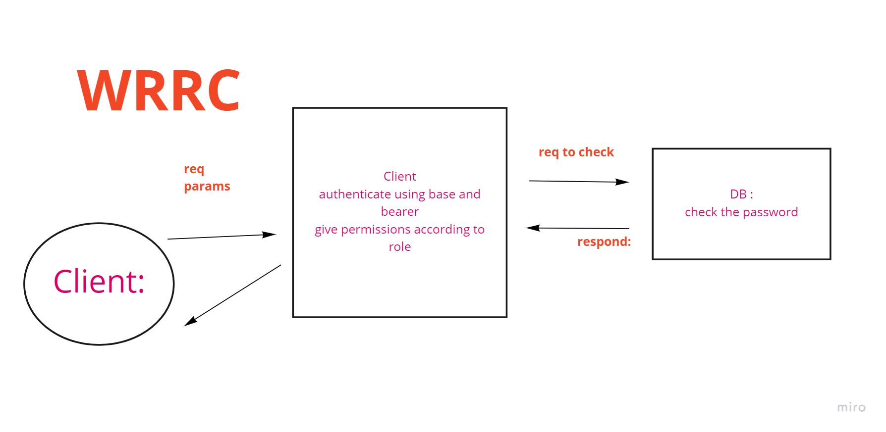
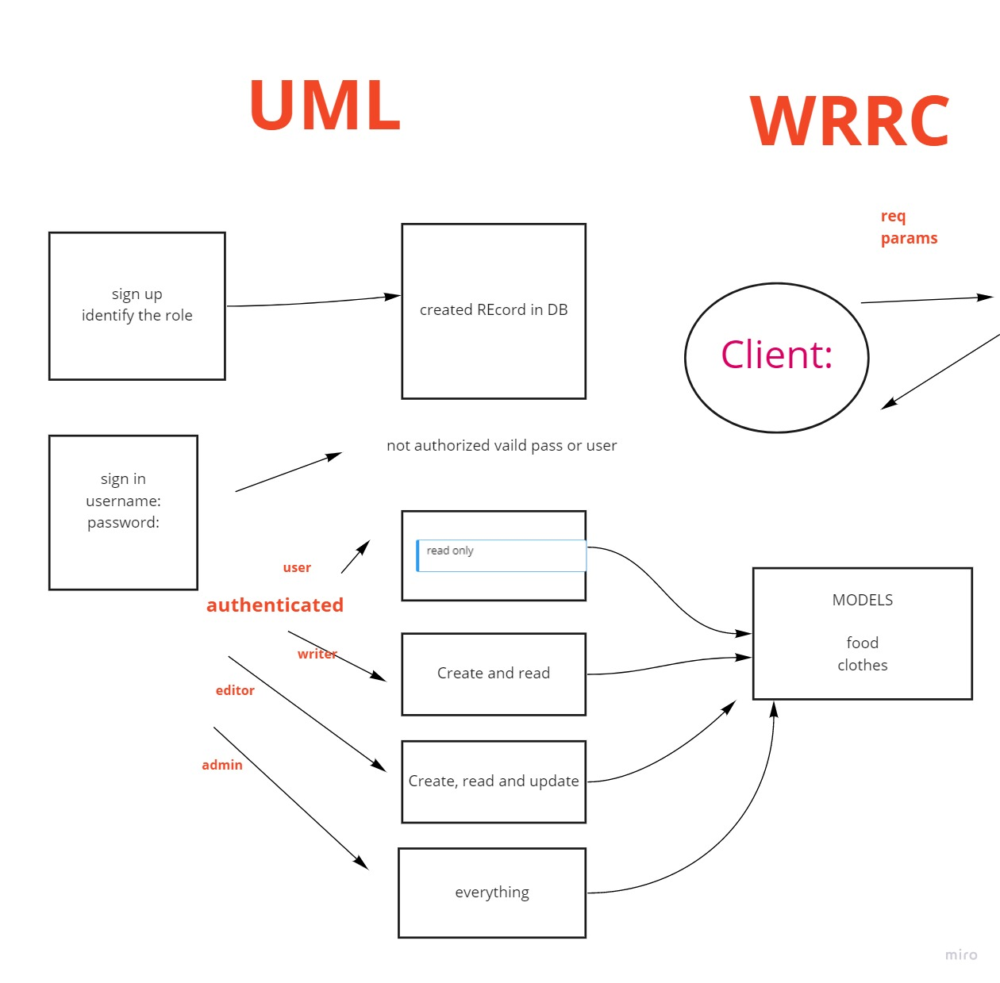

# auth-api/lab8

## Deployment Test
- BACKEND: https://github.com/HaninHaidrah/auth-api 
- PULL request: https://github.com/HaninHaidrah/auth-api/pull/1 
- Heroku: https://auth-app-hanin.herokuapp.com/signup 

## SET UP:
.env /PORT

## Running the app:
npm run watch // Endpoint: /signin signup/users/secret

## Tests:
npm run test

## UML & WRRC:

